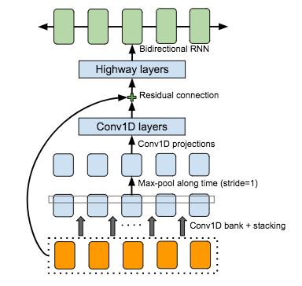
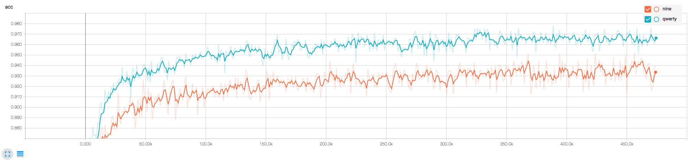

# Neural Pinyin-to-Chinese Character Converter—can you do better than SwiftKey™ Keyboard?

In this project, we examine how well neural networks can convert Pinyin, the official romanization system for Chinese, into Chinese characters.

## Requirements
  * numpy >= 1.11.1
  * TensorFlow >= 1.2.
  * xpinyin (for Chinese pinyin annotation)
  * distance (for calculating the similarity score between two strings)
  * tqdm

## Background

* Because Chinese characters are not phonetic, various solutions have been suggested in order to type them in the digital environment. The most popular one is to use Pinyin, the official romanization system for Chinese. When people write in Chinese using smartphones, they usually type Pinyin, expecting the word(s) to appear magically on the suggestion bar. Accordingly, how accurately an engine can predict the word(s) the user has in mind is crucial in a Chinese keyboard. 

 

* Among several kinds in the Chinese keyboard, the major two are Qwerty keyboard and Nine keyboard (See the animations on the right. One is typing “woaini” to write 我爱你, which means “I love you.” Qwerty is on the left, and Nine is on the right). While in Qwerty each alphabet is associated with one independent space in the former, in Nine the machine is responsible for determining the one the user intended out of 3-4 grouped alphabets. Not surprisingly, it is more challenging to transliterate in Nine than in Qwerty.

## Problem Formulation
I frame the problem as a labelling task. In other words, every pinyin character is associated with a Chinese character or _ which means a blank.

Inputs:  woaini。 
Outputs: 我_爱_你_。
 
## Data
* For training, we used [Leipzig Chinese Corpus](http://corpora2.informatik.uni-leipzig.de/download.html). 
* For evaluation, 1000 Chinese sentences were collected. See `data/input.csv`.

## Model Architecture
* I applied a modified CBHG module introduced in [Tacotron: Towards End-to-End Speech Synthesis](https://arxiv.org/abs/1703.10135).

 

## Training

* STEP 1. Download [Leipzig Chinese Corpus](http://corpora2.informatik.uni-leipzig.de/downloads/zho_news_2007-2009_1M-text.tar.gz).
* STEP 2. Extract it and copy `zho_news_2007-2009_1M-sentences.txt` to `data/` folder.
* STEP 3. Run `build_corpus.py` to build a Pinyin-Chinese parallel corpus.
* STEP 4. Run `prepro.py` to make vocabulary and training data.
* STEP 5. Adjust hyperparameters in hyperparams.py if necessary.
* STEP 6. Run `train.py`. Or download the [pretrained files](https://www.dropbox.com/s/kdwlc400f9edmu8/log.zip?dl=0).

## Evaluation

* STEP 1. Run `eval.py`.
* STEP 2. Install the latest SwiftKey keyboard app and manually test it for the same sentences. (Luckily, you don't have to because I've done it:))

## Results

* The training curve looks like this:

 

* The accuracy changes like this:

 

* The evaluation metric is CER (Character Error Rate). Its formula is

   * edit distance / # characters = CER.

* The following is the results after 19 (nine) or 20 (qwerty) epochs. Details are available in the `eval` folder.

| Layout | # Proposed | SwiftKey 6.4.8.57 |
|--- |--- |--- |
|QWERTY| 1203/10437=0.12 | 717/10437=0.07 |
|NINE| 2104/10437=0.2 |  1775/10437=0.17|

