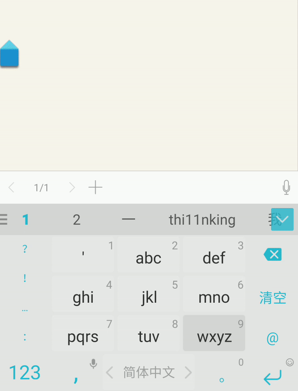
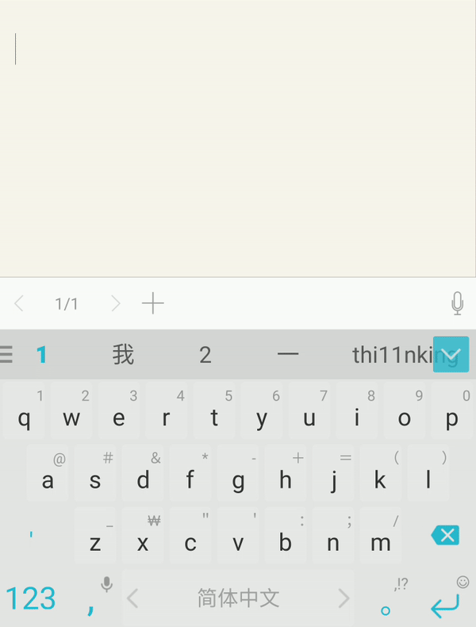
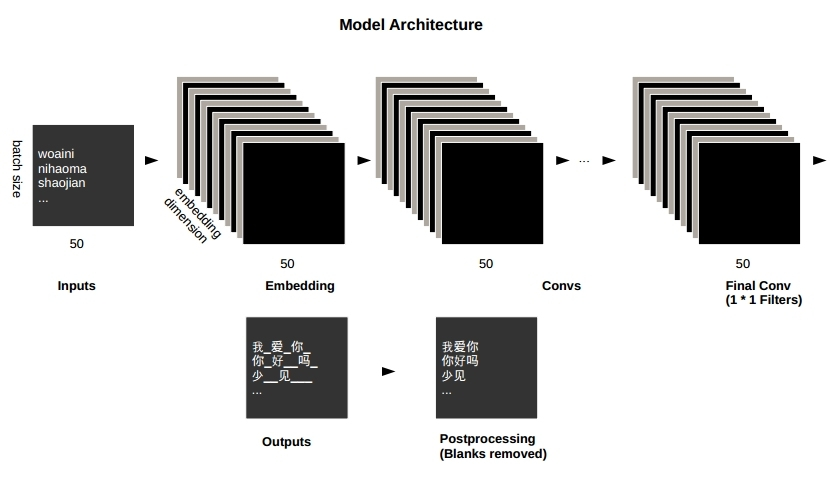

This is an ongoing project me and my colleagues from KakaoBrain.

Pinyin-To-Chinese Character

Goal: Do research on the PTC task using the neural network
* Make the source code and data publicly available
* Write a paper
* Write a blog
* Publish

Research members: Kyubyong Park, Sanghoon Hong, Taesup Kim

Authorship: Equal contribution in principle

Schedule and role
* Data management (K)
* Preliminary experiment (K)
* Code writing (ST)
* Paper writing (K: Outline ST: Body)
* Paper editing (ST)
* Blog writing (KST)
* Administration (K)

Target Conference
* AAAI 2018 (Deadline: around September)
* Most NLP conferences are overed (ACL, EMNLP ->next year)

References:
Keep updating!

 

# Neural Chinese Transliterator—can you do better than SwiftKey™ Keyboard?

In this project, we examine how well CNNs can transliterate Pinyin, the official romanization system for Chinese, into Chinese characters. The evaluation results for 1000 Chinese test sentences indicate that deep convolutional layers can quite easily and quickly learn to transliterate Pinyin to Chinese characters though our simple model failed to outperform SwiftKey™ keyboard.

## Requirements
  * numpy >= 1.11.1
  * sugartensor >= 0.0.1.8 (pip install sugartensor)
  * xpinyin (for Chinese pinyin annotation)
  * distance (for calculating the similarity score between two strings)

## Background

* Because Chinese characters are not phonetic, various solutions have been suggested in order to type them in the digital environment. The most popular one is to use Pinyin, the official romanization system for Chinese. When people write in Chinese in smartphone, they usually type Pinyin, expecting the word(s) they want to appear magically on the suggestion bar. Therefore, how accurately an engine can predict the word(s) the user has in mind is crucial in a Chinese keyboard. 

 

* Among several kinds in the Chinese keyboard, the major two are Qwerty keyboard and Nine keyboard (See the animations on the right. One is typing “woaini” to write 我爱你, which means “I love you.” Qwerty is on the left, and Nine is on the right). While in Qwerty each alphabet is associated with one independent space in the former, in Nine the machine is responsible for determining the one the user intended out of 3-4 grouped alphabets. Not surprisingly, it is more challenging to transliterate in Nine than in Qwerty.

## Problem Formulation
We frame the problem as a classification task for each time step.

Inputs: woaini。 
=> classifier  
=> Outputs: 我_爱_你_。
 
## Data
* For training, we used [Leipzig Chinese Corpus](http://corpora2.informatik.uni-leipzig.de/download.html). 
* For evaluation, 1000 Chinese sentences were collected. See `data/input.csv`.

## Model Architecture

 

## Work Flow

* STEP 1. Download [Leipzig Chinese Corpus](http://corpora2.informatik.uni-leipzig.de/downloads/zho_news_2007-2009_1M-text.tar.gz).
* STEP 2. Extract it and copy `zho_news_2007-2009_1M-sentences.txt` to `data/` folder.
* STEP 3. Run `build_corpus.py` to build a Pinyin-Chinese parallel corpus.
* STEP 4. Run `prepro.py` to make vocabulary and training data.
* STEP 5. Run `train.py`.
* STEP 6. Run `eval.py` to get the results for the test sentences.
* STEP 7. Install the latest SwiftKey keyboard app and manually test it for the same sentences. (Luckily, you don't have to because I've done it:))

## Evaluation & Results

The evaluation metric is score. It is simply computed by subtracting levenshtein distance from the length of the true sentence. For example, the score below is 9 because the length of the ground truth is 10, and the distance between the two sentences is 1.

Expected: 出<b>境</b>手续在哪儿办理？ 
Got&nbsp;&nbsp;&nbsp;&nbsp;&nbsp;&nbsp;&nbsp;&nbsp;     : 出手续在哪儿办理？

The training is quite fast. In my computer with a gtx 1080, the training reached the optimum in a couple of hours. Evaluations results are as follows. In both layouts, our models showed accuracy lower than SwiftKey by 0.5 - 0.7 points). Details are available in `results.csv`. 

| Layout | Full Score | Our Model | SwiftKey 6.4.8.57 |
|--- |--- |--- |--- |
|QWERTY| 10880 | 9397 (=0.86 acc.) | 10106(=0.93 acc.)|
|NINE| 10880 | 8383 (=0.77 acc.) | 8962(=0.82 acc.)|

## Conclusions
* Unfortunately, our simple model failed to show better performance than the SwiftKey engine both in Qwerty and Nine keyboard simulations.
* However, there is still much room for improvement. Here are some ideas.
  * You can refine the model architecture or hyperparameters.
  * We're not sure how accurate the Pinyin annotation results the library xpinyin returns are. It should be helpful if we can improve their accuracy.
  * As always, more data is better.

## Notes for reproducibility
* For Qwerty, download the pre-trained model file [here](https://drive.google.com/open?id=0B0ZXk88koS2Kdko5SHhtZ2h2RVU) and  extract it to `qwerty/asset/train/ckpt` folder.
* For Nine, download the pre-trained model file [here](https://drive.google.com/open?id=0B0ZXk88koS2KRW94N1VveDdSekU) and extract it to `nine/asset/train/ckpt` folder.

	

